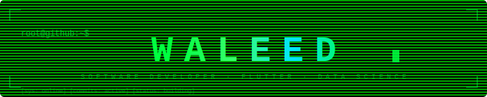

<div align="center">



<br/>

<a href="https://git.io/typing-svg">
  
</a>

</div>

---

## `whoami`

> CS student by day, Flutter builder by night. I care about clean architecture, meaningful products, and understanding the *why* behind everything — not just the syntax.

- 🎓 6th-semester BSCS student
- 📱 Building mobile apps with Flutter · targeting the Play Store
- 🧠 Learning Data Science the right way — concepts first, code second
- 🎮 Indie game developer in progress

---

## `tech-stack`

<div align="center">

**Mobile & Frontend**


**Data & Backend**


**Tools**


</div>

---

## `current-projects`

| Project | Stack | Status | Description |
|---------|-------|--------|-------------|
| **Mind Forge** | Flutter | 🟡 Internal Testing | Cognitive training app with a spy theme |
| **Food Delivery App** | Flutter · Provider | 🟢 In Progress | State management deep-dive via real project |
| **Indie Android Game** | Flutter | 🔵 Planning | Reverse Flappy Bird · multi-world roadmap |
| **ML Research Pipeline** | Python · ResNet | ✅ Complete | Image classifier + metadata ablation study |

---

## `roadmap`

```
2025 ──────────────────────────────────────────────────────────────
         [✓] Flutter Basics   [✓] Provider   [→] Riverpod
         [→] Food Delivery App (ProxyProvider mastery)
         [→] Data Science — Stats · SQL · Pandas · ML Theory

2026 ──────────────────────────────────────────────────────────────
         [ ] DS Capstone Projects × 2
         [ ] Play Store Public Release — Mind Forge
         [ ] MS Applications — Germany · Japan · South Korea
         [ ] Publish Indie Game v1.0
```

---

## `github-stats`

<div align="center">


<br/>


</div>

---

## `contribution-snake`

<div align="center">

<picture>
  <source media="(prefers-color-scheme: dark)" srcset="https://raw.githubusercontent.com/waleed719/waleed719/output/github-contribution-grid-snake-dark.svg"/>
  <source media="(prefers-color-scheme: light)" srcset="https://raw.githubusercontent.com/waleed719/waleed719/output/github-contribution-grid-snake.svg"/>
  
</picture>

</div>

---

## `connect`

<div align="center">

[](https://www.linkedin.com/in/me-waleed-qamar)
[](https://instagram.com/me.waleed.qamar)
[](mailto:wqamar719@gmail.com)

</div>

---

<div align="center">
  <sub><code>Building in public · Learning in depth · Shipping with intent</code></sub>
</div>
